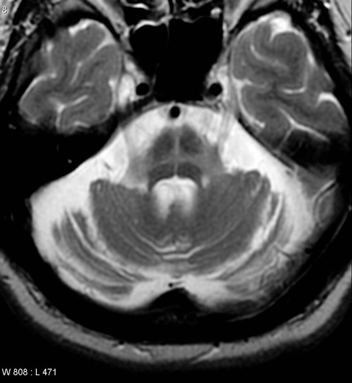

# Hot cross bun sign (pons)
The hot cross bun sign refers to the MRI appearance of the pons when T2 hyperintensity forms a cross on axial images, representing selective degeneration of transverse pontocerebellar tracts and median pontine raphe nuclei. It has been described in a variety of neurodegenerative diseases :

- multiple system atrophy, cerebellar type (MSA-C) (classic sign)
- spinocerebellar ataxia (various types) 
- cerebral vasculitis (causing Wallerian degeneration of pontocerebellar tracts) 
- variant Creutzfeldt-Jakob disease (vCJD)
- JC virus granule cell neuronopathy 

